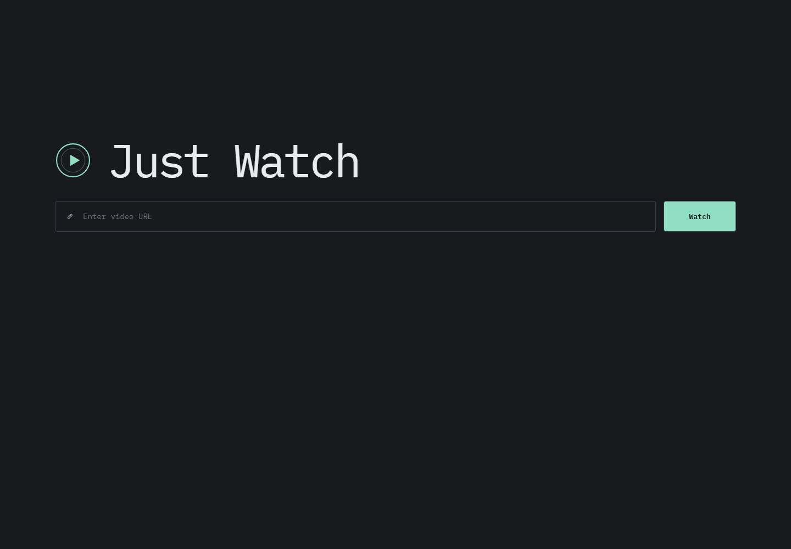
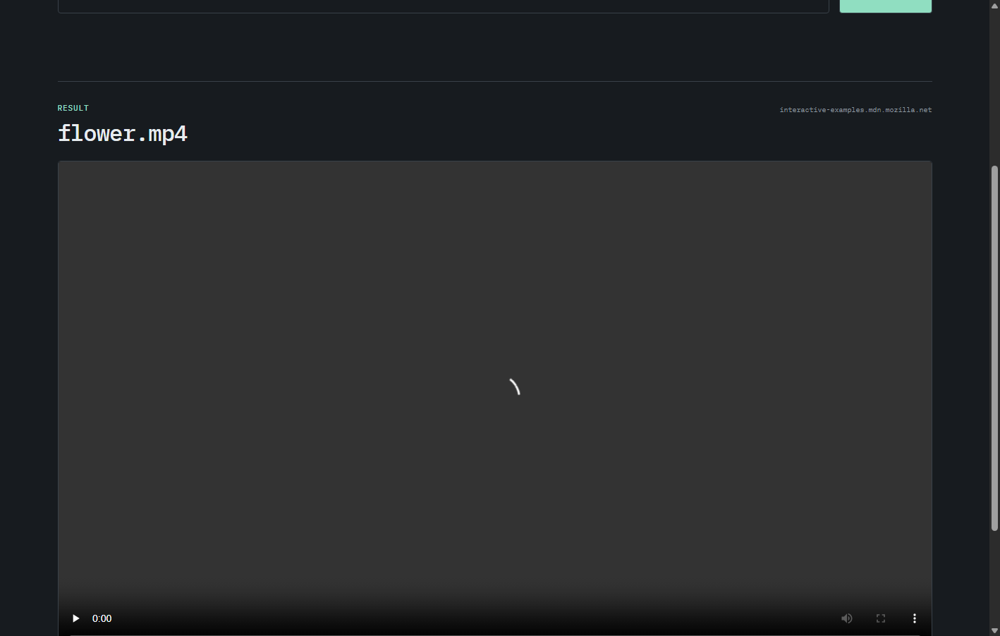
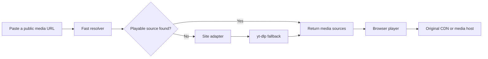

<p align="center">
  
</p>

<h1 align="center">Just Watch</h1>

<p align="center">
  <strong>Just paste. Press Watch. No pop-ups.</strong><br />
  <sub>No redirects. No source-page ads. Just the media.</sub>
</p>

<p align="center">
  A lightweight universal media resolver that finds playable public video sources and opens them in a clean, focused player.
</p>

<p align="center">
  <a href="https://just-watch.primacodes.com/">
    
  </a>
</p>

<p align="center">
  
  
  
  
  <a href="./LICENSE">
    
  </a>
</p>

---

## Preview

### Clean landing page

<p align="center">
  
</p>

### Resolved media playback

<p align="center">
  
</p>

### Mobile layout

<p align="center">
  
</p>

## What is Just Watch?

Just Watch accepts a public video or media-page URL, resolves available playback sources, and returns them to the browser without hosting the media file itself.

The resolver uses a layered approach:

1. Check whether the submitted URL is already a direct media source.
2. Inspect standard HTML video metadata and structured data.
3. Run supported site-specific adapters.
4. Fall back to `yt-dlp` for broader website coverage.
5. Play the selected source directly from the original media host or CDN.

> **About “No pop-ups”**
>
> Just Watch does not open the original ad-heavy player page, inject advertisements, or display source-page pop-ups. It does not remove ads that are already embedded inside a media stream.

## Highlights

- **Minimal interface** focused on one action: paste a URL and press **Watch**.
- **Layered resolver** for fast direct extraction and broad fallback coverage.
- **Direct playback** from the original host instead of storing video files.
- **HLS support** through `hls.js`.
- **MPEG-DASH support** through `dash.js`.
- **VidSonic adapter** for public signed HLS manifests exposed to the browser.
- **yt-dlp fallback** for many public and unprotected media websites.
- **Optional self-hosted Cobalt provider** for supported social-media workflows.
- **No application URL history** through local storage, session storage, or query-string persistence.
- **Responsive layout** for desktop and mobile screens.
- **Vercel-ready** static frontend with Node.js and Python serverless functions.

## How it works



The application does not proxy the full video through Vercel. The API returns source metadata and playable URLs, while the browser requests the media from its original location.

## Supported source types

### Direct media

- MP4
- WebM
- Ogg Video
- HLS playlists (`.m3u8`)
- MPEG-DASH manifests (`.mpd`)

### Standard page discovery

- `og:video`
- `twitter:player:stream`
- HTML5 `<video>` and `<source>` elements
- JSON-LD `contentUrl`
- Relative media URLs resolved against the source page

### Extended providers

- VidSonic public signed manifests
- Websites supported by the installed `yt-dlp` release
- Optional self-hosted Cobalt instance

Support depends on the source website, its current extractor compatibility, access policy, CORS configuration, token rules, and anti-bot protections.

## Architecture

```text
public/
  index.html          Minimal interface, metadata, and JSON-LD
  styles.css          Responsive visual system
  app.js              Resolver flow and media player logic
  favicon.svg         Shared browser and application icon
  og-image.png        1200 × 630 social sharing preview
  robots.txt          Search crawler rules
  sitemap.xml         Canonical production URL sitemap
  site.webmanifest    Installable web application metadata

api/
  resolve.js          Fast Node.js resolver and site adapters
  universal.py        Python resolver powered by yt-dlp and optional Cobalt

scripts/
  setup-universal.mjs Local Python environment setup
  python-runner.mjs   Cross-platform Python command runner
  ui-smoke.mjs        Browser smoke test

tests/
  resolve.test.mjs    Fast resolver tests
  seo.test.mjs        Canonical, metadata, sitemap, and OG tests
  test_universal.py   Universal resolver tests

docs/assets/
  just-watch-desktop.png
  just-watch-result.png
  just-watch-mobile.png

server.mjs            Local development server
requirements.txt      Python dependencies
vercel.json           Vercel Functions and response-header configuration
```

## Privacy behavior

Just Watch is designed not to keep a local URL history.

- The URL input uses `autocomplete="off"`.
- The input is cleared after a successful resolve.
- The application does not write URLs to `localStorage` or `sessionStorage`.
- Submitted URLs are not placed in the page query string or browser History API.
- Resolver API responses use `Cache-Control: no-store`.
- Media files are not uploaded to or stored by the application.

Submitted URLs are still sent to the deployed serverless resolver and then requested from the relevant upstream website. Hosting providers and upstream services may maintain their own operational logs.

## Security controls

The resolver includes protections intended to reduce misuse and server-side request forgery risks:

- Only HTTP and HTTPS URLs are accepted.
- URLs containing embedded credentials are rejected.
- Localhost, private IP ranges, and reserved addresses are blocked.
- DNS results and redirects are validated before use.
- Redirect depth, request size, response size, playlist entries, and processing time are limited.
- Browser cookies and account credentials are not imported.
- Geo-bypass and DRM circumvention are not implemented.
- Sensitive request headers are not returned to the client.

## Local development

### Requirements

- Node.js 22 or newer
- Python 3.12

FFmpeg is not required for the current metadata-only resolver flow because Just Watch does not download, merge, or transcode media on the server.

### Install the universal resolver

```bash
npm run setup:universal
```

This creates an isolated `.venv` and installs the dependencies from `requirements.txt`.

### Start the application

```bash
npm run dev
```

Open:

```text
http://localhost:3000
```

### Run validation and tests

```bash
npm run check
npm test
```

## Deploy to Vercel

Use these project settings:

```text
Framework Preset: Other
Root Directory:   repository root
Build Command:    leave empty
Output Directory: public
Install Command:  default
```

Vercel detects:

- `api/resolve.js` as a Node.js Function.
- `api/universal.py` as a Python Function.
- `requirements.txt` as the Python dependency file.
- `.python-version` as the requested Python runtime version.

The current production deployment is available at:

**https://just-watch.primacodes.com/**

### Search indexing and SEO

The production domain is the canonical URL used by the HTML metadata, Open Graph tags, Twitter Card, JSON-LD structured data, robots file, and sitemap.

```text
Canonical: https://just-watch.primacodes.com/
Robots:    https://just-watch.primacodes.com/robots.txt
Sitemap:   https://just-watch.primacodes.com/sitemap.xml
OG image:  https://just-watch.primacodes.com/og-image.png
```

After deployment, add the domain property to Google Search Console, inspect the canonical homepage URL, request indexing, and submit `/sitemap.xml`. Search rankings are determined by Google and cannot be guaranteed by technical metadata alone.

### Optional Cobalt configuration

Just Watch only uses Cobalt when a self-hosted instance is explicitly configured.

```env
COBALT_API_URL=https://your-cobalt-instance.example.com
COBALT_API_KEY=your-api-key
```

Alternative authorization variables:

```env
COBALT_API_AUTHORIZATION=Api-Key your-api-key
# or
COBALT_BEARER_TOKEN=your-bearer-token
```

## API endpoints

### Fast resolver

```http
POST /api/resolve
Content-Type: application/json

{
  "url": "https://example.com/video-page"
}
```

### Universal resolver

```http
POST /api/universal
Content-Type: application/json

{
  "url": "https://example.com/video-page"
}
```

### Health check

```http
GET /api/health
```

A successful resolver response contains page metadata and one or more source entries:

```json
{
  "ok": true,
  "result": {
    "title": "Example video",
    "sourceHost": "cdn.example.com",
    "sources": [
      {
        "url": "https://cdn.example.com/video/master.m3u8",
        "kind": "hls",
        "mimeType": "application/vnd.apple.mpegurl"
      }
    ]
  }
}
```

## Limitations

“Universal” means broad coverage, not guaranteed access to every video website.

Just Watch intentionally does not bypass:

- DRM systems such as Widevine, FairPlay, or PlayReady
- Login requirements or private account cookies
- Paywalls, subscriptions, or members-only access
- CAPTCHA and anti-bot verification
- Region restrictions
- Private, deleted, or unavailable media
- Tokens tied to a specific account, device, IP address, or browser session

Playback can also fail when:

- A platform changes its website or API.
- The installed extractor is temporarily outdated.
- The source blocks Vercel data-center IP addresses.
- The media host rejects cross-origin playback.
- Audio and video are only available as separate tracks with no directly playable combined format.
- A signed media URL expires before playback begins.

## Responsible use

Use Just Watch only with media that you are authorized to access and play. Respect copyright, platform terms, creator rights, and applicable law.

Just Watch is an independent portfolio project and is not affiliated with any similarly named streaming guide, hosting provider, or media platform.

## License

This project is licensed under the [MIT License](./LICENSE).

Copyright © 2026 Dimas Juli Pratama.
